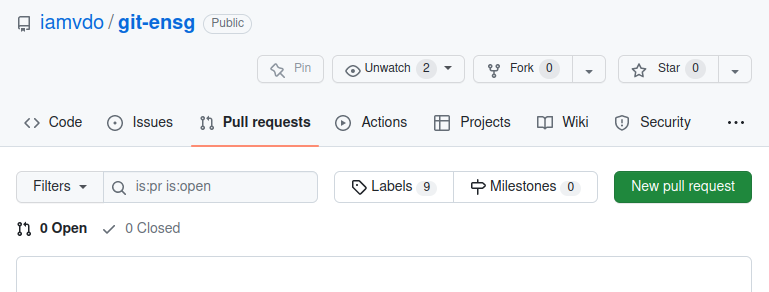
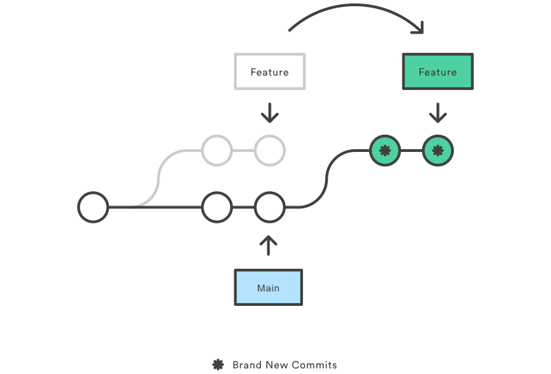

# Git ENSG


**Git est un VCS (Version Control System) ou logiciel de gestion de versions** qui est notamment pensé pour le travail collaboratif. Il offre la possibilité :

- de stocker des fichiers ailleurs que sur votre ordinateur ou une clé USB
- de travailler sur différents fichiers en même temps que d’autres personnes
- de garder un historique de toutes les modifications faites
- de partager des fichiers de manière publique ou privée
- et bien plus encore

**Git est un logiciel libre et open-source, qui ne repose pas sur un serveur centralisé**. Chaque personne d’un projet a donc sa propre copie du projet en local et peut être la référence pour les autres. Malgré tout, il est très fréquent d’utiliser un serveur intermédiaire comme Gitlab ou Github, qui sont des services d’hébergement de fichiers, et qui rendent le partage plus simple.

Git est notamment utilisé pour le code informatique, mais ce sont avant tout des fichiers textes.

## Installation

Git est disponible facilement sur toutes les plateformes. [Télécharger Git](https://git-scm.com/downloads)

Il peut être utilisé en ligne de commande depuis un terminal, ou via des outils graphiques comme les éditeurs de texte tel [Visual Studio Code](https://code.visualstudio.com/). Il existe également l’utilitaire `gitk`.

Pour vérifier la bonne installation :

```bash
git --version
```

### (Création d’un compte GitHub)

Si vous n’avez pas encore de compte, c’est par ici : [Création de compte GitHub](https://github.com/signup)

Ensuite, il faut [configurer un *Personnal token classic*](https://docs.github.com/fr/authentication/keeping-your-account-and-data-secure/creating-a-personal-access-token#cr%C3%A9ation-dun-personal-access-token-classic), une sorte de mot de passe sécurisé. C’est notamment utile pour exécuter des commandes Git qui utiliseront le protocole HTTPS. Conservez ce token dans un fichier texte temporairement (vous n’y aurez plus accès ensuite).

Sur vos machines personnelles, il est préférable [d’utiliser des URLs et une clé SSH](https://docs.github.com/fr/get-started/getting-started-with-git/about-remote-repositories#cloning-with-ssh-urls).

## Configuration

Première chose à faire dans un projet Git, c’est de configurer qui vous êtes :

```bash
git config user.email "votre_adresse_mail"
git config user.name "votre_nom"
```

Note: un flag `--global` permet de définir ce réglage de manière globale, pour tous les projets Git de votre machine. A ne pas utiliser dans le cas de machines partagées.

Depuis l’ENSG, il est également nécessaire de configurer le proxy (déjà configuré en salle de cours) :

```bash
git config --global http.proxy http://10.0.4.2:3128
git config --global https.proxy http://10.0.4.2:3128
```

Pour un meilleur log, il peut aussi être intéressant d’ajouter un alias (utilisable plus tard avec `git lg --all`) :

```bash
git config --global alias.lg "log --color --graph --pretty=format:'%Cred%h%Creset -%C(yellow)%d%Creset %s %Cgreen(%cr) %C(bold blue)<%an>%Creset' --abbrev-commit"
```

Pour voir la config : `git config --list` et `git config --list --global`

## Commencer/Récupérer un projet Git

Pour initialiser un nouveau projet Git, la commande est `git init`. Cependant, il est souvent plus fréquent de créer son projet sur une plateforme en ligne (GitHub, GitLab), puis de récupérer son projet en local (ce que l’on appelle cloner).

!!! info "TP 1 - Commencement"

    A faire une seule fois :

    - créez un repo sur GitHub ou GitLab, avec un README
    - éditez le README en ligne
    - invitez les collaborateurs

    A faire ensuite sur chaque machine :

    - clonez le repo (`git clone <url-repo-distant>`)

    Tout le monde a normalement récupéré le projet !

Quand on souhaite cloner un projet qui ne nous appartient pas, il est préférable d’en créer une copie (ce que l’on appelle un *fork*)

- on «forke» un projet existant dans son espace GitHub/GitLab
- on clone son fork sur son ordinateur avec `git clone <url>`
- on vérifie le bon ajout du dépot distant avec `git remote -v`


!!! info "TP 2 - Commencement"

    A faire une seule fois :

    - faites un *fork* du projet commun :
        - GitHub [https://github.com/iamvdo/git-ensg](https://github.com/iamvdo/git-ensg)
        - GitLab [https://gitlab.com/iamvdo/git-ensg](https://gitlab.com/iamvdo/git-ensg)
    - invitez les collaborateurs

    Sur chaque machine :

    - clonez ce repo
    - ouvrez l’intégralité du projet dans un éditeur de texte
    - (remarquez le dossier caché `.git`)

    Ce site utilise mkdocs pour fonctionner, nous allons donc en avoir besoin en local :

    - installez mkdocs avec `pip install mkdocs`
    - dans le dossier du projet, lancez la commande `mkdocs serve`
    - dans un navigateur, allez à l’URL `http://locahost:8000`

## Fonctionnement de Git

Voilà un diagramme qui explique le fonctionnement général de Git.


En voici le principe :

- **Local Repo** : repository local, c’est à dire le dossier local
- **Remote Repo** : c’est le repository distant, par exemple sur GitHub

Lorsque que l’on modifie/ajoute/supprime des fichiers en local, on modifie alors le **working tree**.

Ensuite, pour enregistrer un ensemble de modifications, il nous faut choisir les fichiers (voir parties de fichiers) à ajouter ou non. Pour cela, nous utilisons les commandes `git add`/`git rm`. Cela ajoute/supprime les fichiers à l’**index** ou **staging area**. L’index est donc une sorte de zone d’attente qui permet de préparer l’enregistrement de ses modifications.

Enfin, pour valider cet ensemble de modifications présent dans l’**index**, il nous faut alors faire **`git commit`**. Cela se réalise au sein d’une **branche locale** (`main` ou `master` par défaut). Après un commit, l’index en cours est vidé.

Ces actions peuvent être répétées autant de fois que nécessaire, et cela sans se soucier de savoir où en est l’avancement du projet distant.

Lorsque l’on souhaite envoyer ses modifications locales sur le repository distant, on utilise `git push`. Mais attention, si d’autres personnes ont déjà fait des modifications, il se peut que cela [génère des conflits](#conflits). Il est donc préférable de récupérer le code distant avant toutes nouvelles modifications à l’aide de `git fetch` ou `git pull`.

Aussi, la plupart du temps, il n’est pas autorisé de mettre à jour directement la branche principale d’un projet. Il faut alors passer par des *pull requests*.

## Les commandes

Quelques commandes utiles pour la prise d’informations :

- `git status` affiche le statut, l’état des différentes zones (working tree, index, branche, conflits, etc.)
- `git branch` liste les branches locales (l’étoile `*` affiche la branche de travail)
- `git remote -v` affiche le nom et l’url des repository distants
- `git lg --all` (commande personnalisée) affiche un arbre des commits et des branches

### Ajouter/Supprimer dans l’index

Voici quelques exemples de `git add` (identique pour `git rm`)

```bash
# Ajouter le fichier test.txt
git add test.txt

# Ajouter le dossier /images
git add /images

# Ajouter tout ce qui est modifié (. est le nom du dossier courant)
git add .

# Ajouter des portions de fichiers
git add -p test.txt
```

### Créer un commit

**Pour enregistrer un état d’historique, on utilise `git commit`**. Chaque commit doit concerner un ajout particulier, une fonctionnalité particulière, que l’on précise par un message. Il est donc recommandé de réaliser de multiples petits commits, plutôt qu’un seul important.

```bash
# Ouvre un éditeur pour écrire le message du commit
git commit

# Creé un commit en précisant directement le message (préférable)
git commit -m "Message du commit"
```

Rappel : les commits se font dans la branche courante.

Il est maintenant possible de se déplacer dans l’historique avec `git checkout <id_commit>`.

### Pousser les modifications

Pour envoyer vos modifications, c’est `git push` en précisant le nom du repository et de votre branche :

```bash
# poussez sur le repo origin, sur la branche main (à vérifier)
git push origin main
```

### Mettre à jour son repo local

Pour récupérer des modifications distantes (faites par d’autres personnes), il faut utiliser `git pull` ou `git fetch` :

- `git pull <nom_repo> <nom_branche>` récupère la branche distante et tente une fusion avec la branche locale.
- `git fetch <nom_repo> <nom_branche>` ne fait que récupèrer la branche distante. Il faut donc ensuite choisir comment fusionner le code, par exemple avec `git merge` ou `git reset`.

```bash
# Récupère la branche main du repo origin et fusionne avec la branche en local
git pull origin main

# Identique à l’exemple précédent
git fetch origin main
git merge origin/main

# Récupère la branche distante main, mais écrase la branche locale
git fetch origin main
git reset --hard origin/main
```

!!! info "TP 1 - Suite et fin"

    A faire sur une seule machine, en local :

    - modifiez le README en ajoutant une description du projet
    - ajoutez le README à l’index (`git add README.md`)
    - faites un commit en local (`git commit -m 'Ajout description'`)
    - (testez de revenir à l’état précédent, puis à l’état actuel avec `git checkout <id-commit>`)
    - poussez sur le serveur distant
    - vérifiez la bonne mise à jour

    Sur les machines qui n'ont pas encore les modifications :

    - récupérez-les avec `git pull`
    - visualisez l’arbre des commits avec `git lg --all`

!!! info "TP 2 - Suite"

    A faire sur chaque machine, en local :

    - dans le dossier `/docs`, créez un nouveau fichier `<nom_prenom>.md`
    - ajoutez votre nom/prenom en titre et votre date de naissance en texte (accès à la [documentation Markdown](https://www.markdownguide.org/cheat-sheet/))
    - visualisez le résultat à l’URL `http://localhost:8000/<nom_prenom>`
    - enregistrez vos modifications dans Git (`git add`, `git commit`)
    - ajoutez une image depuis internet
    - enregistrez vos modifications dans Git (`git add`, `git commit`)
    - poussez sur votre repo distant
    - récupérez les modifications avec `git pull`


## Fusionner les modifications

Souvent, en mode collaboratif, ou quand le projet ne nous appartient pas, seules quelques personnes ont le droit de mettre à jour la branche principale.

**Pour demander l’intégration de nos modifications, nous allons donc passer par une *pull request* (GitHub) ou *merge request* (GitLab)**. Cela se passe directement en ligne. On parle alors de fusion ou de *merge*.

[Documentation Pull Request GitHub](https://docs.github.com/fr/pull-requests/collaborating-with-pull-requests/proposing-changes-to-your-work-with-pull-requests/creating-a-pull-request-from-a-fork).




Note : Une fusion crée un nouveau commit. Pour éviter cela, on peut alors passer par un `rebase`.

!!! info "TP 2 - Suite"

    - créez une *pull request* sur le repo officiel (sélectionnez les bons projets/branches)
    - attendez que toutes les *pull requests* soit fusionnées
    - récupérez les modifications de tous les participants avec `git pull`
    - visualisez l’arbre des commits avec `git lg --all`

!!! info "TP 2 - Suite"

    A faire sur chaque machine, en local :

    - ajoutez un lien vers votre page dans `mkdocs.yml` (clé `nav`), à la suite du lien vers la page d’accueil
    - poussez sur votre repo et récupérez les autres modifications

## Conflits

Lorsqu’une fusion est tentée, mais que deux personnes ont modifié une ou plusieurs lignes d’un même fichier, Git crée un conflit. Cela est symbolisé dans le fichier par un formalisme particulier, qui indique les 2 états du fichier à la suite :

```bash
# début du conflit
<<<<<<< HEAD
    # premier état du fichier
=======
    # second état
>>>>>>> nom_branche
# fin du conflit
```

Il faut donc faire un choix pour conserver seulement la partie 1 (`HEAD` est la position actuelle), la partie 2 (la nouvelle branche), ou les deux. Puis, supprimer le formalisme (`<<<<<<<`, `=======` et `>>>>>>>`). Et enfin, continuez la fusion en cours (`merge`, `rebase` ou autre).

## Branches

Les branches Git permettent notamment de **travailler sur plusieurs tâches en simultané**. C’est aussi utile, tout simplement, parce que le projet distant peut évoluer durant notre propre travail local, ou pour simplifier la gestion des conflits.

Pour créer de nouvelles branches, on utilise `git branch <nom_branche>`. Pour se déplacer sur une branche, c’est `git checkout` ou `git switch` (préférable).

```bash
# Cree une nouvelle branche
git branch nom_branche

# Se déplace sur une branche
git switch nom_branche

# Crée une branche et se déplace en même temps
git switch -c nom_branche

# Supprime une branche
git branch -d nom_branche
```


*Source atlassian.com*

Lorsqu’une branche est créée, son point de départ est l’emplacement actuel du `HEAD` (commit, branche, etc.). Il est possible de déplacer l’intégralité d’une branche, c’est ce que l’on appelle un *rebase*. Cela revient à décrocher la branche de l’emplacement initial, pour la raccrocher à un autre emplacement.


*Source atlassian.com*

!!! info "TP 2 - Suite et fin"

    
    Notre problème actuel : nous avons modifié notre projet local (ajout des liens), mais le repo distant a été modifié également. Nous n’avions pas de branche spécifique. Les 2 branches `main` ont donc divergées. Il nous faudrait donc écraser la branche `main`, mais nous risquons de perdre notre travail. Pour résoudre ce «problème», en local :

    - créez une branche là où vous êtes, mais en restant sur la branche `main` (`git branch <nom_branche>`)
    - récupérez la branche `main` distante (`git fetch origin`) et réinitialisez la branche `main` locale par rapport à cette branche (`git reset --hard origin/main`)
    - déplacez-vous sur votre branche (`git switch <nom_branche>`)
    - rebasez sur la branche main (`git rebase main`)

    Ensuite, cela dépend de ce que vous souhaitez faire :

    - vérifiez votre travail avec `git lg --all`
    - poussez vos modifications
    - créez une *pull request*
    - supprimez vos branches inutiles

## Aller plus loin

Exemple d’intégration de Git dans Visual Studio Code


- [Concepts Git sous forme de jeu](https://learngitbranching.js.org/)
- [Visualizing Git Concepts with D3](https://onlywei.github.io/explain-git-with-d3)
